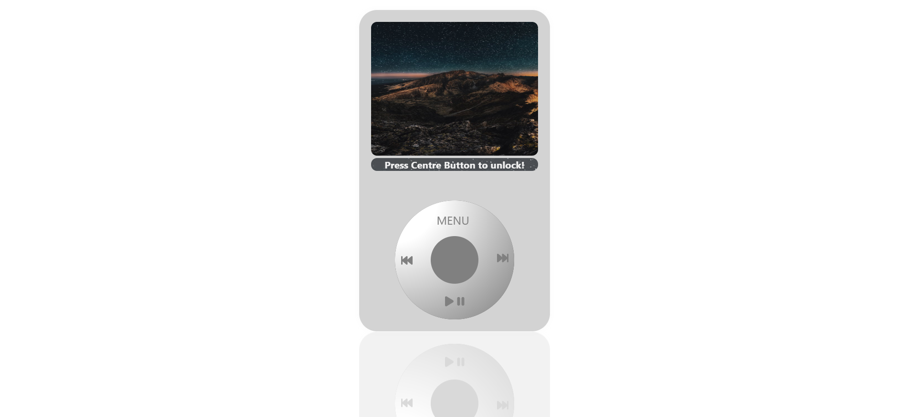

# iPod Mini Project



## Overview

This project is a mini recreation of an iPod-like interface built using React.js. It incorporates various features and technologies to simulate the classic iPod experience with modern web technologies.

### Features

- **Navigation:** Navigate through menus using touch gestures and buttons.
- **Music Playback:** Play, pause, and skip songs with audio controls.
- **Menu Interaction:** Interact with different menus and submenus using both touch and click events.
- **Responsive Design:** Designed to work seamlessly across different screen sizes and devices.
- **Component-based Architecture:** Utilizes React components for modular design and reusability.
- **Styling:** Styled components and CSS modules for enhanced styling and maintainability.

### Technologies Used
[](https://skillicons.dev)
- **React.js:** Front-end JavaScript library for building user interfaces.
- **ZingTouch:** Library for enabling touch gestures and interactions.
- **Styled Components:** For styling React components with scoped styles.
- **CSS Modules:** Modular CSS files scoped locally to each component.
- **Component Lifecycle Methods:** Used for managing state and interactions.

## Installation

To run this project locally, follow these steps:

1. Clone the repository:

   ```bash
   git clone https://github.com/MdIrfan-ul/ipod-mini-project.git
   ```
2. Navigate to the Project Directory:
```bash
   cd ipod-mini-project
   ```
   
3. Install Dependencies:

 ```bash
     npm install
 ```

4. Start the development server:

```bash
npm start
```
5. Open your browser and navigate to http://localhost:3000 to view the application.

## Usage
Use the touch gestures or click events to navigate menus and interact with the interface.
Play and control music playback using the provided controls.
Explore different features and enjoy the nostalgic iPod experience!

## Deployment
Live URL:-``